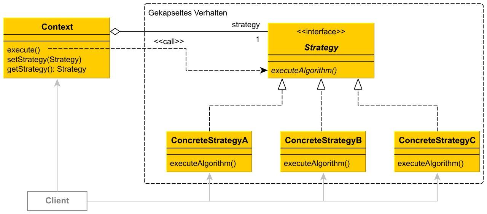

# Software Design Patterns
## Was sind Software Design Patterns?
Software Design Patterns (Entwurfsmuster) dienen als 
Templates bzw. Musterlösungen für Probleme, die in der 
Softwareentwicklung immer wieder auftreten. Ziel ist es 
eine schnelle und effiziente Arbeitsweise zu schaffen, 
sowie dem Code eine Struktur zu geben, damit Außenstehende 
die Funktion eines Codes schneller erkennen können. 
Es wird zwischen drei Klassen unterschieden, abhängig von der 
Problematik der Situation: Creational Patterns, Structural Patterns 
sowie Behavioural Patterns.
## Behavioural Patterns
Wir haben uns dazu entschieden auf das Behavioural Patterns,
zu Deutsch Verhaltensmuster, näher einzugehen. Verhaltensmuster 
sind Muster, welche komplexes Verhalten von Code kapseln. Ziel ist 
es für Außenstehende eine simple und übersichtliche Struktur zu erschaffen. 
Ein passendes Beispiel hierfür wäre Google Maps. Die App berechnet 
die Route von A nach B. Dabei muss der Faktor des Fortbewegungsmittels 
in Betracht gezogen werden - es mach einen Unterschied, ob man zu Fuß, 
mit dem Auto oder mit dem Fahrrad unterwegs ist. Erst zur Laufzeit 
entscheidet das Strategy Pattern welcher Algorithmus benötigt wird. 
Was bei diesem Beispiel auffällt, ist, dass die Routenberechnung 
eigentlich gleich bleibt. Den Unterschied macht die Wahl des 
Fortbewegungsmittels aus. Die Vereinfachung und Kapselung der 
Komplexität nach außen ist Zweck des Strategy Patterns. Der große 
Vorteil hierbei ist, dass man neue Strategien implementieren kann, 
ihnen den Kontext zu ändern. Bezogen auf unser Beispiel ist es auch 
ein Vorteil, dass man Algorithmen innerhalb eines Objektes in Laufzeit 
wechseln kann. Die Vorteile des Strategy Pattern können sich jedoch auch 
in Nachteile umwandeln, wenn man nur wenige Algorithmen hat, welche selten 
wechseln (Merke: Entwurfsmuster dienen zur Vereinfachung, Übersichtlichkeit 
und Stabilität!)

Die Grafik visualisiert die Funktion des Strategy Patterns 
(Kontext = Objekt; Strategie = abgekapselter Algorithmus). 
Es ist ersichtlich, dass der Kontext nicht abhängig von einer 
Implementierung ist, daher können unterschiedliche Verhalten 
zugewiesen werden, ohne dass ein Code geändert werden muss. 
Zusammenfassend kann man sagen, dass das Verhalten unabhängig 
vom Kontext wird. Der Kontext selbst wird unabhängig von einer 
Implementierung.
